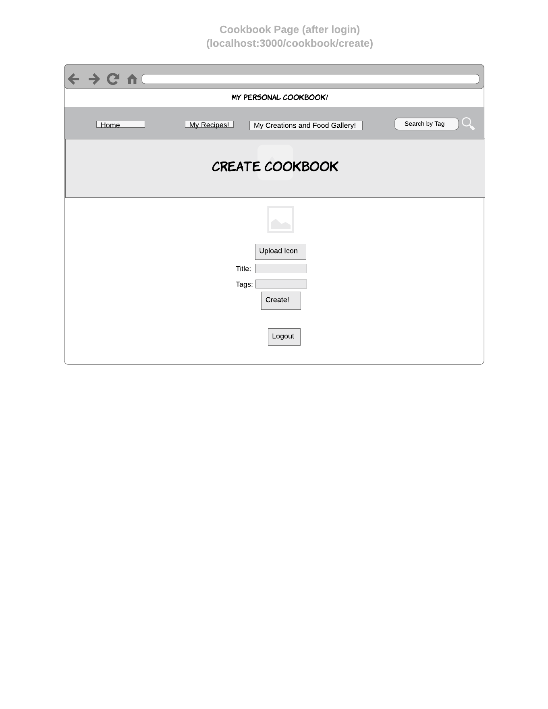
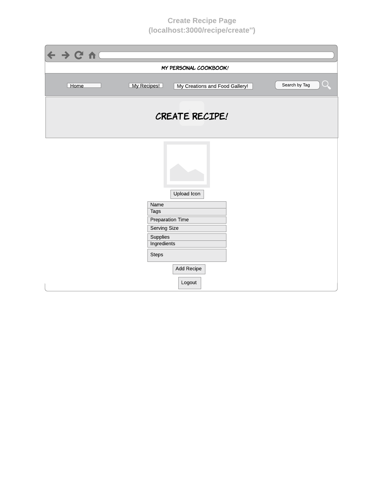

# My Personal Cookbook!

## Overview

Have you ever wished you had virtual cookbooks filled with your favorite recipes and images of your food creations? My Personal Cookbook could be just what you are looking for!

My Personal Cookbook is a web application that will allow users to keep track of their own personal cookbooks and recipes, search other recipes and cookbooks in the database by tag as well as upload pictures of the food they have created. Users can register and login. Once they're logged in, they can add recipes by inputting data. Users can upload and view images of the food they have created on the site. Only users with an account can create cookbooks and add their recipes and images (as well as view and search for entities by tag).


## Data Model

The application will store Users, Cookbook, Recipes and Images

* users can have multiple cookbooks (via references)
* each cookbook can have multiple recipes (via references)
* users have a gallery filled with images of their food creations (via references)


An Example User with References:

```javascript
{
  username: "cooking1203",
  password: // a hashed password
}
```

An Example Cookbook with References:

```javascript
{
  creator: // a reference to a User object
  title: "Dessert Delight",
  tags: ["Dessert"] //an array of keywords
  icon: //image uploaded by user(optional)
}
```


An Example Recipe with References:

```javascript
{
  creator: // a reference to a User object from database
  name: "Cheesecake",
  tags: ["Dessert"]
  ingredients: ["2 cups of cream cheese", "A box of graham crackers"],
  supplies: ["Measuring cups", "Mixing Bowl"],
  prepTime: "1 hour", // String
  servingSize: 3, //Number
  steps: ["Grind graham crackers until it is like powder"], //array of strings
  icon: //an image
  cookbooks: // an array of references to cookbooks
}
```

An Example Image with References:

```javascript
{
  creator: // a reference to a User object from database
  caption: "Cheesecake is the best!",
  icon: Object//an image
}
```

## [Link to Commented First Draft Schema](db.js)


## Wireframes

/ - start page for login and registering users


/home - page for viewing your cookbooks


/cookbook/create - page for creating your cookbooks



/myrecipes - page for showing all of the user-created recipes and option to create recipe


/mygallery - page for showing all of the user's gallery of food images


/cookbook/slug - page for showing specific cookbook and option to add recipes from the database


/recipe/create - page for creating a recipe



/search?tag='' - page for showing search results after searching by tag in the search bar or clicking the tag button under the recipe or cookbook


## Site map


## User Stories or Use Cases

1. As a non-registered user, I can register a new account with the site
2. As a user, I can log in to the site
3. As a user, I can create a new cookbook
4. As a user, I can view all recipes in my cookbooks and add recipes from the database to the cookbook
5. As a user, I can add my own recipes
6. As a user, I can upload images of the food I created from recipes
7. As a user, I can view all of the images I uploaded on a single page
8. As a user, I can search up recipes and cookbooks in the database by tag (view search results on single page)
9. As a user, I can click the tag buttons to view other recipes and cookbooks with the same tag


## Research Topics


* Integrate user authentication
    * Using passport for user authentication and registration which is an authentication middleware for Node
* Use a CSS framework such as Bootstrap
    * Develop a stable and appealing interface for users
* Use external APIs
    * Use GridFS and Multer APIs to store and retrieve images in the database


## [Link to Initial Main Project File](app.js)


## Annotations / References Used


1. [passport.js authentication docs](http://passportjs.org/docs) - (add link to source code that was based on this)
2. [Tutorial on grid.js](https://docs.mongodb.com/manual/core/gridfs/)
3. [Tutorial on gridfs and multer](https://blog.zairza.in/uploading-files-images-to-mongodb-using-gridfs-c16f4eba777)
4. [Bootstrap Tutorial](https://www.w3schools.com/bootstrap/)
5. [Bootstrap Documentation](https://getbootstrap.com/docs/4.0/getting-started/introduction/)
6. [Passport-local authentication and registration](https://scotch.io/tutorials/easy-node-authentication-setup-and-local#toc-handling-signupregistration)
